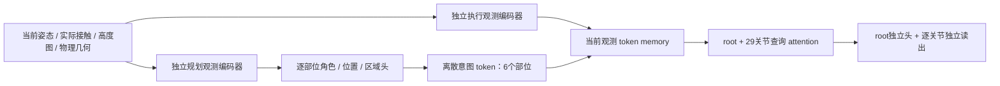

# Predictor v2：保留条件身份的整身读取

2026-10-08：维护中的 scratch 训练入口改用 `StructuredPositionPredictor`，
checkpoint schema 为 `full1000_position_predictor_v2`。本轮只实现与验证架构，未启动训练。
数据、损失、权重、教师调度、Newton 接触规则和权威机器人资产不变。

2026-10-09 当前状态：v2 整体替换在后续递推对照中退化，已标记未采用。
正式训练入口按用户要求回到 v1；本文件以下保留 v2 的设计与实验历史，
不代表当前默认架构。v1 从零重训使用新的统一区间 loss，未读取 predictor checkpoint。
对照结论见 `baselines/predictor_control500_20261009/architecture_decision.json`。

## 查明的问题与本轮边界

v1 执行先将当前部位、未来位置、角色与区域的编码相加，再将六个部位平均到一个
向量，交给同一个36维姿态输出层。当前训练还强制执行梯度进入共享观测编码器。
这三个机制分别削弱条件身份、集中输出表示、耦合两条任务的可训练参数。

此前冻结模型的诊断显示：同状态的几何/FK方向有效；同一条腿在不同状态中需要相反
修正，而共享读出上的其他样本更新会干扰该状态。移除规划的当前梯度并未消除这个
现象，冻结特征也仍能提供姿态信息。因此没有证据把全部问题归因于共享编码器，
也没有证据证明平均读出是唯一原因或整网已完全表征坍缩。

v2 是针对这三个机制的架构修正。它不保证不同样本的参数梯度不会冲突，训练后仍须
用固定测试集、分接触条件统计和相同30步递推比较，不能用随机初始化推理证明改善。

## 信息流

每个观测编码器具有自己的高度图 CNN、观测投影、身份编码、terrain attention、
self-attention 和 LayerNorm，全部训练参数独立。允许共享的只有不含训练参数的
canonical FK、碰撞形状和当前物理特征计算；执行不会读取规划的 latent 特征。

当前观测 token 按固定顺序保留：

| Token | 数量 | 信息 |
| --- | ---: | --- |
| root | 1 | 去除全局 yaw 后的 root 旋转 |
| 部位姿态 | 6 | 各部位当前局部位置与旋转 |
| 实际接触 | 6 | 实际接触激活及当前 anchor，inactive anchor 被屏蔽 |
| 关节 | 29 | 按权威 G1 关节顺序的当前关节角 |
| 物理几何 | 可选 | 按部位/碰撞 link 保留原几何特征，每个实体独立 token |

执行 memory 再附加6个有部位身份、未来类型身份的意图 token。
每个意图的 active、局部目标点、角色 one-hot、区域 flags 先拼接明确字段再编码，
不将它加到当前观测的 token 上。inactive 目标点被屏蔽。教师条件和离散计划复用同一
公共选择逻辑，保持真实区域证据、角色校验与历史明确的计划冻结语义。

root 和29个关节分别发出30个查询，读取观测与意图，再 self-attention 协调整身。
查询含可训练身份及从权威 URDF 提取的关节→部位祖先关系。没有硬屏蔽跨肢体信息，
以免禁止 root/躯干/四肢的整身协调。root 输出7维；每个关节的独立输出行只读取自己
的解码 token。没有将六个部位或30个查询平均再复制给所有自由度。

attention 本身仍是内容与查询决定的加权混合；这里移除的是所有部位等权平均后共用
一个读出向量。残差连接及向 token 添加身份不是语义流替代，保留这些常规操作。

## 训练、版本与入口

- 当前正式基线为[latest v1](../../../baselines/predictor_v1_latest_20261010/README.md)；
  本文v2独立编码器与逐关节token改版保留为未采用的显式实验。
- `python -m generator.train_full1000_position` 当前默认v1、scratch初始化，
  `execution_observation_gradients` 默认True。显式v2实验须传
  `--architecture full1000_position_predictor_v2 --no-execution-observation-gradients`；
  v2 仍拒绝共享梯度。以下独立 token、参数组和读出描述仅适用于v2。
- Planner/executor 各自独立裁剪，所有训练参数恰好归属一组，无 shared 参数组。
- 原训练集关节均值初始化改写逐关节 bias，不改变 root 头、其他权重或验证集使用规则。
- 模块编译列表跟随新模型接口；物理查询与教师校验保持 eager。
- `python -m generator.evaluate_position_rollout` 是正式递推入口。
  原tmp脚本只转发这个实现，没有独立schema分支。
- `load_position_predictor` 根据显式schema构造模型；v2同时校验完整配置、token/joint
  顺序与架构contract，严格加载参数。不能将v1权重静默塞入v2。
- v1 支持明确版本的从零训练及 checkpoint 读取，checkpoint不能作为新训练初始化。
  历史配方快照不改写为新实验，历史模型仍可做同条件结果比较。
- 静态梯度审计加载相同版本并验证重载输出，检查各损失的参数组梯度；不构造优化器，
  不再导入旧tmp归档模型。v1的shared组允许作为历史诊断报告，v2检查任务参数隔离。

## 其余架构检查

| 路径 | 发现 | 处理 |
| --- | --- | --- |
| 维护中的position predictor | 部位均值、意图加到观测、共享训练编码器 | v2逐项替换，训练入口明确选v2 |
| 可选body几何观测 | v1曾将各link几何增量平均到root | v2按link保留几何token |
| `contact_location_predictor` / `planned_contact_predictor` | ordered token flatten后读出 | flatten保留顺序；不等价于部位平均，历史版本不改算法 |
| `next_interaction*` / `conditioned_pose_predictor` | 多个旧模型有部位平均读出 | 不在新scratch训练路径；保留历史checkpoint语义，按schema显式读取 |
| `neural_infiller` | 条件拼接后MLP、时间token和AdaLN | 未发现相同的六部位latent均值路径；没有将其当作本次诊断的修复对象 |
| 旧`contact_q_generator` | terrain自适应空间平均 | 旧模板模型，不进入v2；不借本轮重写其已训练权重 |
| FK与几何摘要 | 每个物理实体内部点云的mean/min/max | 保留实体身份，沿用原几何定义，不用于重新定义接触 |
| 损失、日志与误差统计 | mean等统计汇总 | 不属于latent条件丢失，保持原优化目标 |

原始Newton候选、激活、分配和受力保持区别；有效接触仍使用公共主向上表面选择。
意图不是实际接触，几何观测不是接触真值。没有新增距离阈值或碰撞/QP教师。

## 验证

测试覆盖编码器参数/存储隔离、双向任务梯度隔离、独立逐关节读出、观测/意图的
不同token位置、角色条件作用、inactive屏蔽、teacher区域语义、四种几何配置、
保存重载、错误版本/顺序拒绝、训练集bias初始化、全局平移/yaw等变及旧模型回归。
CLI只做解析与导入验证。本轮没有训练、没有以未训练v2递推作为动作质量验收。

## 2026-10-08 当前状态材料点缓存

递推仍为一次预测、一次优化器更新、一次验收提交/回退。`KeepPatchCache` 只缓存
当前输入的实际 Newton 材料点，不缓存预测距离、损失、梯度或验收决定。示范按数据行、
递推按池槽位保存；完整姿态精确相等且场景身份一致才允许命中，运行内场景/资产不可变。
成功提交从已有预测查询绑定材料点，失败保留原输入材料点，重采样优先复用相应示范缓存。
空接触是合法缓存状态；未分配的激活约束仍报错。旧嵌套递推没有独立槽位身份时仍实时查询。
缓存不进入网络输入或 checkpoint，重启后重新建立；材料点数量动态扩容，不截断接触。

`performance.json` 的 `keep_patch_cache` 记录累计实际查询样本数、命中样本数、示范
缓存转用样本数及张量存储字节数（包含评估访问，不是单轮计数）。

真实 Newton 小实验使用正式 motion 8 的 128 个姿态、16 query worlds，训练继续运行。
当前状态查询＋keep loss＋反传的中位耗时由 89.50 ms 降为 13.81 ms，缓存 180352 字节。
loss 最大差为零，梯度最大绝对差 1.53e-5，通过 rtol=1e-5、atol=1e-6 检查。
这是局部计时，不代表整轮训练提速；正在运行的旧进程不会热加载该修改。
证据及复现脚本：`tmp/keep_patch_cache_20261008/`。

## 2026-10-08 算子与完整几何查询性能实验

`SolidDistanceScene.query` 将候选对的 AABB 退出界、联合包围盒和距离上界按样本批量
计算，Coal 调用顺序、形状对集合、GJK/EPA 容差及无效 witness 报错保持不变。
对正式 motion 8 的 128 个姿态及其下沉 10 cm 的诊断姿态，改前改后全部返回字段
逐位一致；查询中位耗时分别从 55.21/131.91 ms 降为 32.18/99.93 ms。

网络采用已有 `--compile-modules` 开关，不改层数、token、loss 或精度。固定权重、
128 个数据集输入、全部输出头参与的前向反传实验由 317.38 ms 降为 249.67 ms；
输出最大绝对差 9.54e-7、梯度最大绝对差 4.77e-7，通过各自浮点容差检查。
编译仍为显式配置，不能把未开启编译的旧运行当作已启用优化。

两项合并的原配方 5 轮短测，第 2–5 轮教师阶段（1470 样本/轮、12 次更新）平均
由缓存基线的 9.343 s 降为 8.210 s（减少 12.1%）。首次训练轮含编译为 29.886 s，
未纳入平均；这不是全部初始化/编译时间。分项计时开启了额外 CUDA 同步。
该实验验证性能和数值接近性，不证明长训练质量不退化，也未覆盖反馈递推阶段。
514 项 generator/contact_solver/core 测试通过。原始 profile、脚本和结果均在
`tmp/predictor_perf_opt_20261008/`，正式训练未自动重启。

## 2026-10-08 batch 与神经网络 BF16 对照

独立实验对同一 512 个训练输入累积同一个平均梯度，不执行优化器更新，避免把
减少更新次数误计为吞吐量收益；所有配置开启网络编译。以下显存仅为网络实验的
峰值 allocated，不包含正式训练的 Newton workers 或优化器状态。

| 配置 | 样本/秒 | 峰值 allocated MiB |
| --- | ---: | ---: |
| FP32 batch 128 | 492 | 3779 |
| FP32 batch 256 | 483 | 7492 |
| FP32 batch 512 | OOM | — |
| 神经模块 BF16 batch 128 | 1105 | 2156 |
| 神经模块 BF16 batch 256 | 1135 | 4233 |
| 神经模块 BF16 batch 512 | 1132 | 8369 |
| 仅执行分支 BF16 batch 128 | 669 | 3161 |

FK、姿态解码、规划离散选择和 loss 在 autocast 外；神经模块输出转回 FP32。
将规划编码也降为 BF16 时，固定输入中 164 个激活部位的目标网格改变，不能仅凭
连续输出误差小就宣称等价。保留规划分支 FP32、仅将 executor_observation、
execution_read、execution_coordination 置于 BF16 后，512 输入的角色、网格和
区域选择全部一致。第 350 轮模型的额外检查仍保持规划一致，但身体点平均/最大
位置差为 0.301/1.490 mm；这不是 Newton 接触验收一致性证明。

执行分支 BF16 的 5 轮真实 loss 短测仍用 batch 128，教师阶段第 2–5 轮平均由
8.210 s 降为 7.352 s（减少 10.46%）。第 5 轮自主验证：平均穿透 2.692→2.281 cm，
keep excess 4.620→5.564 cm，newton_generation_accepted 12.69%→9.87%。
短训结果有得有失，不能推断长期质量等价或退化；不修改正式训练精度默认值。
BF16 入口仅为 `tmp/predictor_batch_bf16_20261008/train_probe.py` 的诊断包装，
其精度边界由同目录 launch 元数据记录，不能误作正式训练配置。未启动长训练。

## 2026-10-08 保持 FP64 几何的 Coal C++ 批量调用

`SolidSceneRouter` 默认采用 `native_batch`：AABB 候选顺序不变，将已有 Coal
几何实例、刚体变换和原 DistanceRequest 一次传入 C++，逐对调用原 `coal::distance`。
不缓存 GJK 初值，不更换算法、容差、形状对或材料点梯度；无效距离和 witness
仍检查并报错。`SolidDistanceScene` 的 `python` 后端保留为数值对照，其他直接
使用它的调用方不因此改变默认后端。router contract 记录实际 backend。

扩展源码在 `somaforge_core/coal_batch.cpp`；初始化时通过当前 Coal 的头文件、
动态库及匹配的 Boost.Python ABI 编译，按源码和 ABI/库身份缓存于项目
`tmp/coal_batch/`。需要 C++17 编译器及 Eigen 头文件；缺失时明确失败，不静默
换解算器。构建有进程锁，编译不发生在训练查询循环内。

固定 128 个正式姿态以及下沉 10 cm 的姿态，全部返回字段逐位相等：

| 几何查询 | Python | C++ batch |
| --- | ---: | ---: |
| 原姿态，14 对穿透 | 32.69 ms | 15.28 ms |
| 下沉姿态，2491 对穿透 | 100.88 ms | 19.33 ms |

另用已有 step350 网络的 128 个预测姿态测试：3819 对穿透的字段、完整实体深度
平方损失及 FK 姿态梯度均逐位相同（CPU 固定输入对照，不是完整闭环验收证明）。
521 项原有及新增测试整体通过；随后增加的 5 类几何（球、盒、胶囊、柱、椭球）
后端间梯度一致性测试也通过。真实 G1 柱/凸体的 600 个邻域姿态、反向点对、
空候选及无效距离/坐标边界均有回归覆盖。

实际 FP32、batch128、`--compile-modules` 的有限训练计时如下；排除首次编译轮，
两边损失、数据、更新次数和接触标准相同，均开启分项计时：

| 路径 | 每轮预测/更新 | Python | C++ batch | 时间减少 |
| --- | --- | ---: | ---: | ---: |
| 教师阶段，5 轮中第 2–5 轮 | 1470 / 12 | 8.210 s | 7.244 s | 11.77% |
| 递推池，3 轮中第 2–3 轮 | 2750 / 22 | 14.954 s | 13.476 s | 9.88% |

递推池实验从 scratch、warmup=0 开始，只用于覆盖实际 pool + demonstration
训练路径；第 3 轮两边均推进 8 次/回退 1272 次，不代表已训练模型的状态分布或
长期泛化。教师阶段初始化和初始完整评估相同，但第 1 轮平均 loss 已有约 2e-6
差异，后续训练轨迹分叉；最终自主 generation accepted 为 12.69%/3.21%。此次
固定输入验证不能解释所有训练分叉，更不能据短训证明长训质量不变。

尝试将接触位置计算改为局部坐标系中的线段—网格距离，值及梯度一致，但耗时
112.77→118.12 ms，已经撤回。采用的提速仅来自 C++ 批量调用，未采用 BF16。
全部有限实验正常结束，未自动启动正式长训练。脚本、launch、逐轮日志及报告在
`tmp/predictor_native_batch_20261008/`。
